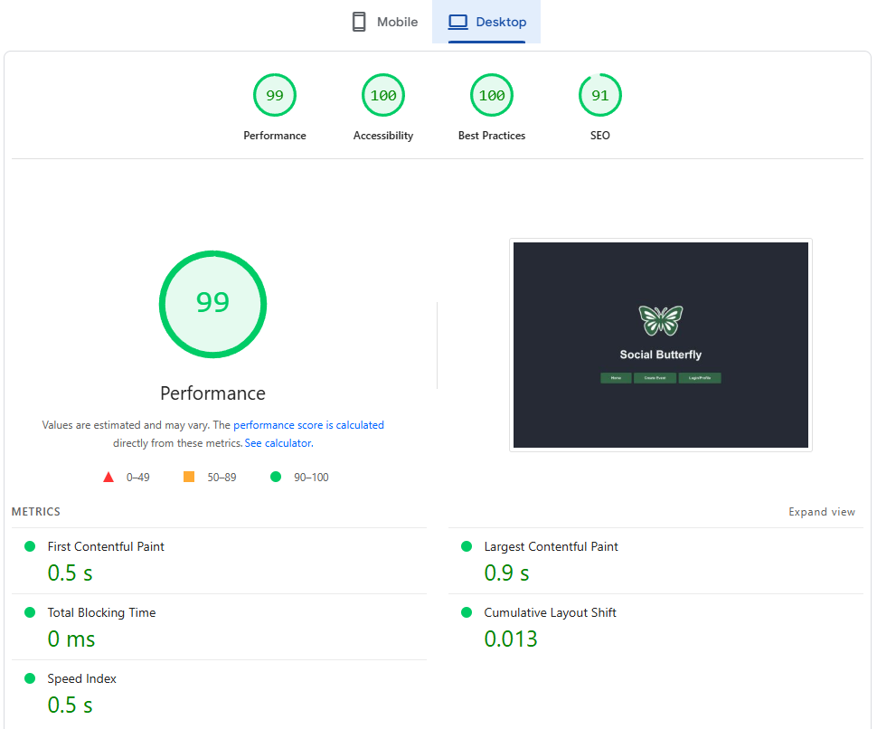
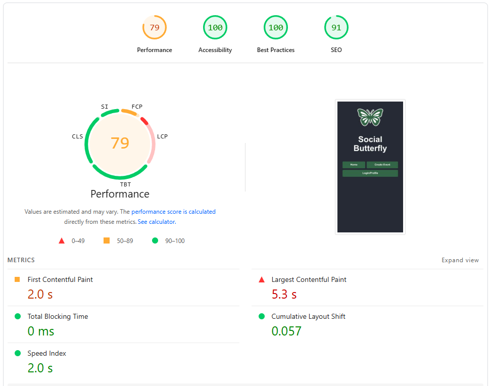

# Social Butterfly

Apin löydät [täältä](https://ebfs.github.io/ppwk-2025/app/)

## arvioinnissa käytetyt kriteerit:
- idea = jokin käytännöllinen sivusto, jossa on hyödyllistä tietoa
- sisältö = sivustolla on toimintoja, joilla voidaan tietoa tutkia
- visuaalisuus ja selkeys = Nielsen heuristiikkojen mukainen käytettävyys
- sivuilla on samanlainen navigointi ja ulkoasu, joka täyttää WCAG eli Web Content Accessibility Guidelines -ohjeistuksen
- responsiivisuus = toimivuus eri kokoisilla päätelaitteilla (testaa ja tee lyhyt raportti)
- autentikoinnin (Firebase), tietokannan (Firestore) ja kolmannen osapuolien palveluiden (esimerkiksi REST-rajapinnan yli) käyttö
- toimivuus uusimmilla selaimilla (testaa ja tee lyhyt raportti)
- sivujen latautumisaika kohtuullinen (testaa ja tee lyhyt raportti)

## Idea:
Idea perustuu appiin jonka ystävä haluaisi minun rakentavan. Appissä käyttäjät voivat luoda tapahtumia, ja muut käyttäjät voivat löytää tapahtumia (ja mennä paikan päälle) ja olla vuorovaikutuksessa niiden kanssa kommentoimalla. Tavoite on saada ihmiset liikkeelle ja sosialisoimaan.

## Sisältö:
Sivulla voi luoda tilin, login, luoda tapahtumia (nimi, päivämäärä, aika, tiedot, lokaatio), ja selailla näitä 'event feed':in kautta. Yksittäisiä tapahtumia voi katsella ja kommentoida.

## Visualisuus ja selkeys:
'Create Event'iin ei pääse ilman että on kirjautunut, samoin ei myöskään voi kommentoida tapahtumiin ilman että on kirjautunut. Create eventissä estetään tapahtuman julkaisua ellei ole täyttänyt tarpeelliset kentät (Nimi, päivämäärä ja aika, tiedot. Karttatiedot ovat vapaaehtoista.). Liian pitkät tapahtumakommentit lyhennetään mutta voidaan avata painamalla 'show more.' - ettei kommenttikenttää pysty spammaa pitkillä viesteillä mitkä tukkii sitten koko homman, kommentit ovat samoin 256 char limited.

## Samanlaisuus:
Sivustolla on samanlainen navigointi ja ulkoasu.

## Responsivisuus:
Valitettavasti käytössäni on vain pöytäkone ja oma Samsung puhelin, mutta tuli tilanteita missä piti muokata näkymää että näyttäisi paremmalta luurilla. Esimerkki:
```
      <style>
        {`
          .char-counter {
            text-align: right; /* Desktop default */
            font-size: 0.8rem;
          }

          @media (max-width: 600px) {
            .comment-input-row {
              flex-direction: column;
            }
            .post-button {
              align-self: flex-start;
            }
            .char-counter {
              text-align: left; /* Override for mobile */
            }
          }
        `}
      </style>
```
Tämän lisäksi, sivusto on responsiivinen selaimen koon kanssa ja siirtää napit/navigoinnin/yms selaimen koon mukaan.

## Autentikointi, tietokanta, ja kolmas osapuoli
Sivusto käyttää Firebasea kirjautumista varten, Firestorea säilyttämään tapahtumien metadatan ja kommentit. Leaflet karttaominaisuus toimii kolmantena tekijänä.

## Toimivuus eri selaimmilla:
Microsoft Edgellä ja Google Chromella sivusto näyttää identtiseltä. Google Chrome Androidilla toimii, ja siinä on joitakin asioita siirrelty että näyttää hyvältä.

## Latautumisaika:

#### Desktop:


Pöytäkoneella kaikki sujuu erittäin hyvin.

#### Mobile:


Mobiililla on parannettavaa:

`Requests are blocking the page's initial render, which may delay LCP. Deferring or inlining can move these network requests out of the critical path.LCPFCPUnscored`

- Tämän korjaaminen nopeuttaisi sivun lataamisaikaa.

`Reducing the download time of images can improve the perceived load time of the page and LCP. Learn more about optimising image size`

- Kuvien filetyypin muuttaminen png -> webp, avif vähentää ladattavan tiedon määrää.
- Caching myös vähentäisi ladattavan tiedon määrää.

Apin löydät [täältä](https://ebfs.github.io/ppwk-2025/app/)

-----------------------------------------------------------------------------------

-----------------------------------------------------------------------------------

-----------------------------------------------------------------------------------


# Community Event Hub (Vanha julkaisu)

## Tavoite:
Käyttäjät voivat luoda tapahtumia, ja muut käyttäjät voivat olla vuorovaikutuksessa niiden kanssa ilmoittautumalla, liittymällä mukaan, kommentoimalla ja lisäämällä kuvia tapahtumasta. Tavoite on saada ihmiset liikkeelle ja sosialisoimaan.

## Ominaisuudet:

**Tapahtuman luominen**
- Otsikko, kuvaus, päivämäärä/aika, sijainti (valinnainen: karttapinni).
- Mahdollisesti tunnisteet tai kategoriat (esim. “Musiikki”, “Urheilu”, “Meetup”).

**Tapahtumasyöte / lista**
- Lista tulevista tapahtumista.
- Suodatus/haku päivämäärän, kategorian tai sijainnin mukaan.

**Tapahtuman yksityiskohdasivu**
- Näyttää tapahtuman tiedot.
- Käyttäjät voivat kommentoida tapahtumaa.
- Käyttäjät voivat ladata tapahtumaan liittyviä kuvia (tallennetaan Firebase Storageen).

**Käyttäjäprofiili / autentikointi**
- Firebase Authentication (sähköposti/salasana tai Google-kirjautuminen).
- Käyttäjät voivat muokata omia julkaisujaan ja kommenttejaan.

## Roadmap:

### Tehty:

- React-sovellus rakennettu Vite:llä.

- ProtectedRoute-komponentti käytössä rajoittamaan pääsyä Luo tapahtuma -sivulle.

- Navigaatiopainikkeet tyylitelty yhtenevästi kirjautumispainikkeiden kanssa

- Firebase/Firestore

- Reititys täysin toiminnassa, sisältäen tapahtumasyötteen, Luo tapahtuma- ja Kirjaudu-sivut.

- Responsiivinen layout mobiilille (max-width: 600px rootissa app.css:ssä, flex-wrap nav-painikkeille ja otsikko/päivämäärä-riville).

- Otsikot, painikkeet ja typografia yhteneväisiä.

- Luo tapahtuma lomake

- Pääsiäismuna

### Known issues:

- Aikavalitsimen tyylittely: tunti- ja minuuttikentät korkeampia kuin päivämääräkenttä. Samoin Samsung Android -> minuuttikenttä on päivämäärä- ja tuntikentän alla.

### Työn alla:

#### Tehtävät:

- Luo tapahtumasivu

- Lomake on jo olemassa (otsikko, kuvaus, päivämäärä/aika, kategoria (puuttuu), valinnainen sijainti (puuttuu)).

- Tallenna tiedot Firestoreen events-kokoelmaan.

#### Tapahtumasyöte

- Hae tapahtumat Firestoresta (done).

- Näytä lista- tai korttinäkymänä.

- Sisällytä valinnainen suodatus/haun toiminto (kategorian, päivämäärän, sijainnin mukaan).

#### Tapahtuman yksityiskohdat

- Hae yksittäinen tapahtuma ID:n perusteella.

- Näytä kaikki tiedot: kuvaus, päivämäärä/aika, luojan tiedot.

- Kommentit ja kuvat lisätään myöhemmin.

- Tulos: Käyttäjät voivat lisätä ja katsella tapahtumia.

#### Kommentit

- Kommentit

- Alikokoelma jokaisen tapahtuman alle.

- Vain kirjautuneet käyttäjät voivat kommentoida.

-  Näytä kommentit tapahtuman yksityiskohtasivulla.

#### Kuvat

- Latauspainike → Firebase Storage.

- Tallenna lataus-URL Firestoreen images-alikokoelmaan.

- Näytä kuvat tapahtuman yksityiskohtasivulla.

- Tulos: Jokaisella tapahtumalla voi olla kommentteja ja kuvia.

#### Valinnainen sijainti/karttaintegraatio

- Käytä Google Mapsia / OpenStreetMapia (esim. react-leaflet).

- Mahdollista sijainnin valinta tapahtumaa luotaessa.

- Näytä sijainti tapahtuman yksityiskohtasivulla.

#### Esteettömyys & käyttökokemus

- Alt-teksti kuville.

- ARIA-labelit painikkeille/lomakkeille.

- Näppäimistönavigointi.